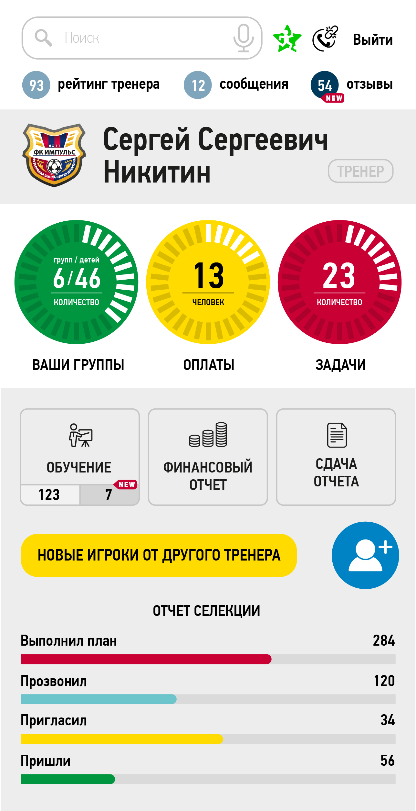

# Football school (football)

Football school Sergei Nikitin (test task)

Page layout and assignment:



<blockquote>
"Выполнение плана" отображаем в %, исходя из значений пунктов ниже
<br/>
"Прозвонил"  ​​>35 номеров - 100%
<br/>
​​"Пригласил" ​​>20 раз - 100%
<br/>
​​"Пришли" >5 - 100%
<br/>
Ссылки пока никуда не ведут
</blockquote>

## Install the dependencies
```bash
npm install
```

### Start the app in development mode (hot-code reloading, error reporting, etc.)
```bash
quasar dev
```

### Lint the files
```bash
npm run lint
```

### Build the app for production
```bash
quasar build
```

### Customize the configuration
See [Configuring quasar.conf.js](https://quasar.dev/quasar-cli/quasar-conf-js).
